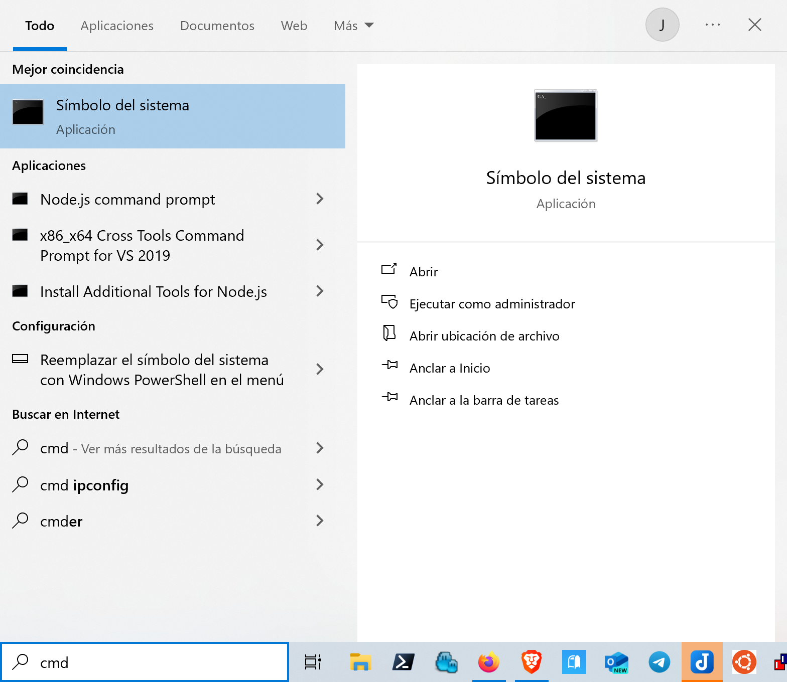

```{r setup, include=FALSE}
knitr::opts_chunk$set(echo = TRUE)
```

## INSTALAR JAVA EN WINDOWS 10

Comprobamos si está instalado java:


Vamos a la página de Eclipse temurin:

[https://adoptium.net/es/temurin/releases/](https://adoptium.net/es/temurin/releases/)

Y nos descargamos la versión adecuada, en el caso de Windows:


> DEBEMOS ELEGIR UNA VERSIÓN **LTS**.

Y seguimos los pasos:


> MUY IMPORTANTE: En el segundo paso hay que elegir la opción de la imagen para instalar la opción de JAVA_HOME, y así poder ejecutar todos los comandos de JAVA, incluido javadoc, desde el terminal:


Y terminamos la instalación:


Una vez ha finalizado, abrimos una ventana de terminal:



Y comprobamos que se ha instalado correctamente, para ellos comprobamos la versión de java y que se puede ejecutar el comando javadoc:


