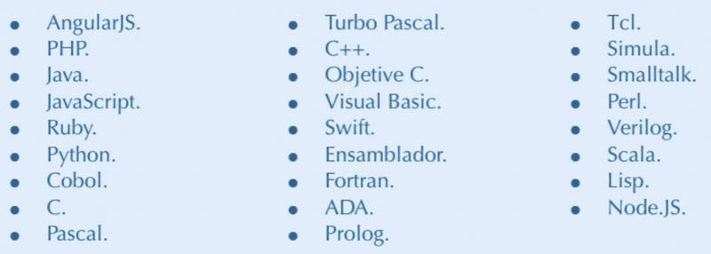

```{r setup, include=FALSE}
knitr::opts_chunk$set(echo = TRUE)
```

## EJERCICIO 01

### 1. Crea una tabla usando markdown donde se clasifiquen los siguientes lenguajes de programación:



### 2.Elige uno de los lenguajes anteriores y explica cuales son sus puntos fuertes y sus puntos débiles.
