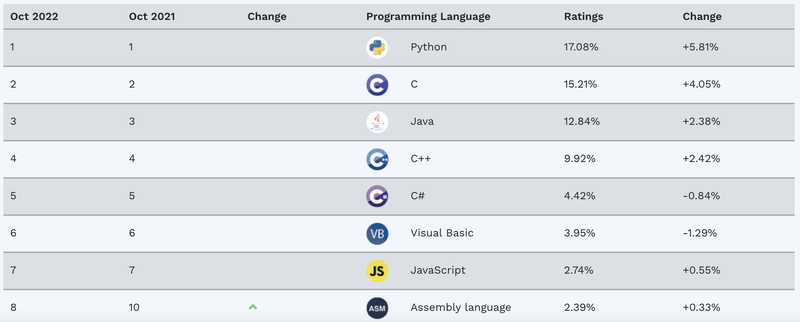
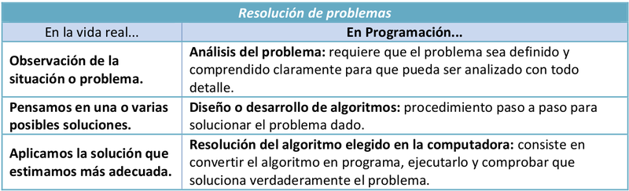
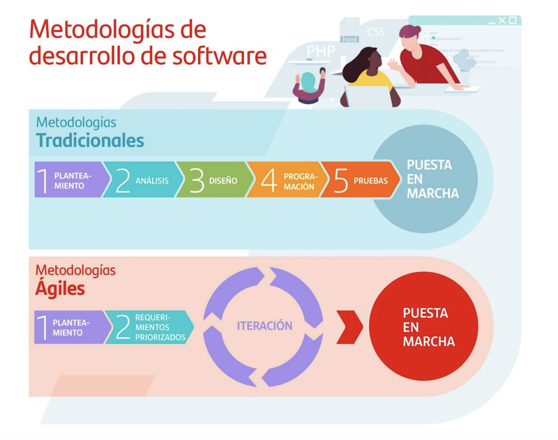

```{r setup, include=FALSE}
knitr::opts_chunk$set(echo = TRUE)
```

## RESULTADOS DE APRENDIZAJE

Reconoce los elementos y herramientas que intervienen en el desarrollo de un programa informático, analizando sus características y las fases en las que actúan hasta llegar a su puesta en funcionamiento. 

--- 

# CONTENIDOS
## [Orígenes del Software. Concepto de Software.](#uno)
## [Instrucciones y datos.](#dos)
## [Ejecución de programas en ordenadores.](#tres)
## [Lenguajes de programación](#cuatro)
## [Introducción a la ingeniería del software](#cinco)
## [Proceso de obtención de código ejecutable a partir del código fuente.](#seis)
## [Errores en el desarrollo de programas.](#siete)
## [Importancia de la reutilización de código.](#ocho)
## [Criterios de Evalución](#nueve)
## [Resultado de aprendizaje](#diez)
## [Criterios de Calificación](#once)

--- 

## <a name="uno">Orígenes del Software. Concepto de Software</a>

El concepto de **software** fue utilizado por Charles Babbage (1791-1871) hace mucho tiempo. Cuando trabajaba en su máquina diferencial, utilizaba series de instrucciones que se leían desde la memoria principal del sistema, y a esta serie de instrucciones las denominaba software.


> En el Science Museum de Londres, podrás ver algunos mecanismos que Charles Babbage desarrolló pero que no finalizó. Para los más morbosos y/o frikis, parte de su cerebro se encuentra conservado en formol en el Royal College of Surgeons de la misma ciudad.

En 1840 Charles Ada Byron (o Ada Lovelace) tradujo  al inglés unas notas que el ingeniero militar y matemático Luigi Menabrea había hecho sobre una conferencia para presentar la máquina diferencial de Babbage, y al hacerlo, añadió un apéndice tan extenso que constituía un artículo en sí mismo. Las notas de Ada se publicaron en la revista Scientific Memoir en septiembre de 1843, con el título de «Sketch of the analytical engine invented by Charles Babbage», que firmó con sus iniciales A. A. L.

En estas notas, Ada escribió:

> Terminamos estas notas siguiendo en detalle los pasos a través de los cuales la máquina podría computar los Números de Bernoulli, siendo este (en la forma en que lo deduciremos) un ejemplo bastante complicado de su poder.

 
 
 > Ada Lovelace.

Este algoritmo para calcular los números de Bernoulli  -una serie de fracciones con diferentes aplicaciones en matemáticas- se ha considerado por muchos como el primer programa/algoritmo de la historia. Consecuentemente, muchos perfiles de la figura de Ada Lovelace lo celebran como la primera persona programadora de la historia. 

Posteriormente, Alan Turing (1912-1954) profundizó en el concepto de software. Este desarrolló su carrera como matemático, pero destacó en su momento como informático y criptógrafo, participando activamente en el desciframiento de los códigos de la máquina "ENIGMA" usada por los alemanes en la Segunda Guerra Mundial. Sin embargo, sus logros se vieron truncados, ya que, tras ser acusado y y procesado por ser homosexual, se suicidó.

Diseñó un dispositivo teórico denominado *"máquina de Turing"* y desarrolló la teoría de la computación, la cual se tiene como referente hoy en día y forma parte del origen del software moderno.
Se considera a Turing uno de los padres de la ciencia de la computación, antecedente de la informática moderna.

Por otro lado, el término software se empleó como tal por primera vez John Wilder Tukey (1915-2000) en un artículo de la revista American Mathematical Monthly en 1958.

En este artículo, donde se empleó el término **computer software** por primera vez, se hablaba de aprovechar las capacidades de cálculo de los ordenadores de tal manera que os programadores pudiesen escribir conjuntos de instrucciones (programas), los cuales podrían llegar a ser complejos, que luego se traducirían en otras más comprensibles para las máquinas en las que fueran a ser ejecutadas.

Como puede observarse, se establecían las bases de los modernos compiladores. J. W. Tukey también creó otro término imprescindible en la tecnología computacional, la palabra **bit** como contracción de "dígito binario", por su abreviación del inglés binary digit.

El término **informática** viene del acrónimo de procesamiento de la INFORmación de forma autoMÁTICA.


## <a name="dos">Instrucciones y datos.</a>

El término **programa** referido a la computación especifica un a secuencia de **instrucciones**, comprensibles para el ordenador, que permiten el procesamiento de unos **datos de entrada** y produce unos **datos de salida**.

Debemos tener claros entonces los conceptos de datos e instrucciones:

Los **datos** son aquellos valores que cumplen una serie de requisitos para poder ser representados e interpretados independientemente del soporte donde se guarden. (Una dirección postal, un número de teléfono, una foto, ...).

La representación de dichos datos por medio de caracteres es uno de los medios más usuales para realizar la entrada (desde el teclado) y salida(hacia el monitor) de estos.

Los datos atómicos (caracteres) pueden ser:

   - Letras Mayúsculas: A B C D E F G H I J K L M N O P Q R S T U V W X Y Z
   - Letras Minúsculas: a b c d e f g h i j k l m n o p q r s t u v w x y z
   - Dígitos: 0 1 2 3 4 5 6 7 8 9
   - Símbolos de puntuación: , ; . : ? ! ( ) [ ] { }
   - Otros símbolos: = + - / * > < \ @ # $ % ˆ & | _ ~ ’ "
   - Caracteres de control: tabulador, nueva-línea, retorno-de-carro, nueva-página, etc.
   - Otros caracteres:

Los caracteres se codifican numéricamente según una tabla de correspondencia:
 
 - ASCII (7 bits). 
 - ISO-8859 (8 bits). 
 - Unicode (32 bits).
 
A cada carácter se le asocia un número.Para codificar **N** símbolos distintos se necesitan **x** bits, tal que: 

$2^{x-1} < N ≤ 2^x$

Unicode (32 bits) tiene diversas formas de codificación: UTF-8, UTF-16, UTF-32.

Las **instrucciones** representan acciones atómicas y sencillas que tienen un significado concreto y son de duración limitada. (leer, escribir, sumar, restar, ...)

<a name="tres"></a>
## Ejecución de programas en ordenadores.
### Datos y programas.
El término **dato** indica toda información que utiliza el ordenador en las ejecuciones de los programas. 

Un **programa** es una secuencia de comandos, comprensibles para el ordenador, que permiten la realización de una tarea determinada. 

### Hardware frente a software.
Como sabemos, al conjunto de dispositivos físicos que conforman un ordenador se le denomina **hardware**. Existe una relación indisoluble entre éste y el software, ya que las aplicaciones o **software** necesitan estar instalados y configurados correctamente para que el equipo funcione.

El software se ejecutará sobre los dispositivos físicos y de manera dependiente a éste. Para que un software funcione correctamente, debe de ser ejecutado en un hardware concreto o que cumpla una serie de requisitos.


### Estructura funcional de un ordenador: procesador, memoria.
La primera arquitectura hardware con programa almacenado se estableció en 1946 por John V on Neumann:


Arquitectura Von Neumann (programa almacenado):
- **Procesador (Unidad Central de Procesamiento – CPU)**: ejecuta las instrucciones.
   - **Unidad de Control (CU)**: controla la ejecución de las instrucciones.
   - **Unidad Aritmético/Lógica (ALU)**: realiza operaciones aritméticas y lógicas con operandos numéricos (binarios).
   - **Registros**: almacenan operandos numéricos, resultados de las operaciones, así como información adecuada para la ejecución del programa.
   - **Buses** (Control, Direcciones y Datos): son el medio para la transferencia de información entre el procesador, la memoria principal y el resto de dispositivos.
   - El tamaño de la palabra de CPU indica el número de bits con el que es capaz de trabajar el procesador.
   - La frecuencia del reloj y el tamaño de la palabra de CPU determinan la potencia del procesador.
- **Memoria Principal**: almacena tanto los programas como los datos (en forma de números codificados en binario). RAM, ROM.
- **Memoria Secundaria**: sistemas de almacenamiento persistente (no-volátil).
- **Dispositivos Periféricos**: transferencia de información con el exterior (ENTRADA - SALIDA).


### Tipos de Software. BIOS. Sistema. Aplicaciones.
Según su función se distinguen tres tipos de software: sistema operativo, software de programación y aplicaciones.


El **sistema operativo** es el software base que ha de estar instalado y configurado en nuestro ordenador para que las aplicaciones puedan ejecutarse y funcionar. Son ejemplos de sistemas operativos: Windows, Linux, Mac OS X ...

El **software de programación** es el conjunto de herramientas que nos permiten desarrollar programas informáticos, tienen ese propósito concreto y están diseñadas para ser usadas por profesionales. Los programas informáticos pueden usarse para desarrollar aplicaciones o bien para controlar otros dispositivos (brazo robótico, escáner de código de barras, ...).

Una **aplicación informática** está en contacto con el usuario y y no con el hardware. Será el sistema operativo el que haga de nexo de unión entre ambos (aplicación informática y hardware).

Existe multitud de aplicaciones informáticas que automatizan o ayudan a la realización de ciertas tareas como, por ejemplo:

Entre los diversos tipos de software podemos encontrar, por ejemplo:
- Programas de contabilidad.
- Bases de datos.
- Programas de diseño gráfico.
- Procesadores de texto.
- Programa de facturación.
- Aplicaciones multimedia.
- Hojas de cálculo.
- Presentaciones.
- Herramientas de correo electrónico.

Un caso especial de software es la **BIOS**. BIOS significa “Basic Input-Output System” que viene a ser sistema básico de entrada salida. Se almacena en un chip integrado en la placa base y es la interfaz o puente entre tu sistema operativo y el hardware de nuestro equipo. Todas las acciones que hagas a nivel software, como por ejemplo hacer clic en un programa, son traducidas en instrucciones que pasan a través de la BIOS y a continuación mandadas al monitor, tarjeta gráfica etc. 

La BIOS integra un software que se carga al encender el ordenador y chequea que todo esté correcto antes de cargar el sistema operativo. El alto acoplamiento entre el software y el hardware de la BIOS establece el concepto de **[firmware](https://es.wikipedia.org/wiki/Firmware)**.

### Código fuente, código objeto y código ejecutable; máquinas virtuales.
- El **código fuente** es el conjunto de archivos que contienen órdenes o instrucciones que forman el programa. Para hacer cambios en un programa es necesario acceder al código fuente.

  Las instrucciones son ejecutadas por la CPU que funciona del siguiente modo: obtiene la obtiene la primera instrucción de la memoria, la decodifica para determinar el código de operación y los datos, después la ejecuta y en algunos casos almacena el resultado. Este proceso se ejecuta continuamente hasta que se leen todas las instrucciones del programa.

- Se llama **código objeto** al código que resulta de la compilación del código fuente. Puede ser en lenguaje máquina o bytecode, y puede distribuirse en varios archivos que corresponden a cada código fuente compilado.

  Luego un enlazador (linker) se encarga de juntar todos los archivos de código objeto para obtener el programa ejecutable.

- Por último, el **código objeto**: Conjunto de instrucciones y datos escritos en un lenguaje que entiende el ordenador directamente: binario o código máquina.

Provienen de la traducción de cierto código fuente, es un fragmento del programa final y es específico de la plataforma de ejecución.

Una máquina virtual es software de proceso nativo, es decir, ejecutable en una plataforma específica, capaz de interpretar y ejecutar instrucciones expresadas en un código binario especial, el cual es generado por el compilador del lenguaje que estemos utilizando (por ejemplo Java).

<a name="cuatro"></a>
## Lenguajes de programación.
Los lenguajes de programación han evolucionado a lo largo del tiempo para aumentar su rendimiento y facilitar el trabajo a los programadores. Cada vez, existen lenguajes de programación que son más amigables con el usuario y, por tanto, más fáciles de programar.

Muchas veces, el que se programe más rápido y los programas sean más sencillos de realizar provoca que estos sean más lentos y que ocupen más espacio.


### Tipos de lenguajes de programación.
A continuación, se muestran las características de los lenguajes de programación existentes en la actualidad:

#### Lenguaje máquina:
- Sus instrucciones son complejas e ininteligibles. Se componen de combinaciones de unos y ceros.
- No necesita ser traducido, por lo tanto es el único lenguaje que entiende directamente el ordenador.
- Fue el primer lenguaje utilizado. En su momento, los expertos debían tener un dominio profundo del hardware para poder entender este lenguaje de programación.
- Difiere para cada procesador. Las instrucciones no son portables de un equipo a otro.
- Salvo excepciones, actualmente, nadie programa en este lenguaje.
- Es dificil de comprender y programar.
- Dada la dificultad y poca portabilidad del lenguaje máquina, el ensamblador lo sustituyó para facilitar la labor de programación.


#### Lenguaje de medio nivel
- Dada la dificultad y poca portabilidad del lenguaje máquina, el ensamblador lo sustituyó para facilitar la labor de programación.
- Sigue estando cercano al hardware, pero, en lugar de unos y y ceros, se programa usando mnemotécnicos, que son instrucciones más inteligibles por el programador que permiten comprender de una forma más sencilla que hace el programa.
- Este lenguaje necesita compilarse y traducirse al lenguaje máquina para poder ser ejecutado.
- Se trabaja con los registros del procesador y direcciones físicas. En lenguajes de nivel más alto, ya se utilizan variables y estructuras más sofisticadas.

#### Lenguajes de alto nivel:
- La mayoría de los lenguajes de programación actuales pertenecen a esta categoría.
- Tienen una forma de programar más intuitiva y sencilla.
- Más cercano al lenguaje humano que al lenguaje máquina (por ejemplo: WHILE 
var DO...DONE).
- Suelen tener librerías y funciones predeterminadas que solucionan algunos de los problemas que suelen presentarse al programador.
- En ocasiones, ofrecen frameworks para una programación más eficiente y y rápida.
- Suelen trabajar con mucha abstracción y orientación a objetos. De esa manera, es más fácil la reutilización y y el encapsulamiento de componentes.


### Características de los lenguajes más difundidos.
Podemos definir las características de los lenguajes de una manera más educada si los agrupamos según  la forma en la que son ejecutados: 

a) **Lenguajes compilados**. Necesitan un programa traductor (compilador) para convertir el código fuente en código máquina. Este tipo de programas se ejecutan de forma más rápida que los interpretados o los virtuales. Además del compilador, existe un programa llamado enlazador o linker que permite unir el código objeto del programa con el código objeto de las librerías.

b) **Lenguajes interpretados**. No se genera código objeto. El intérprete es un programa que tiene que estar cargado en memoria y se encarga de leer cada una de las instrucciones, interpretarlas y ejecutarlas. Las instrucciones se traducen on the fly y solamente aquellas que van ejecutándose, en vez de interpretar todo el programa.

c) **Lenguajes virtuales**. Son lenguajes más portables que los lenguajes compilados, puesto que el código que se genera tras la compilación es un código intermedio o bytecode. Este código puede ser, a su vez, interpretado por una máquina virtual instalada en cualquier equipo. Tienen una ejecución lenta, pero su versatilidad para poder ejecutarse en cualquier entorno los hace muy apreciados.

Aquí podemos ver el grado de uso de los diversos lenguajes de programación según TIOBE:

FUENTE: [TIOBE Index](https://www.tiobe.com/tiobe-index/)


<a name="cinco"></a>
## Introducción a la ingeniería del software:
### Proceso software y ciclo de vida del software.
Una vez que un programa es desarrollado, será utilizado durante un largo periodo de tiempo. Durante su periodo de utilización, el software deberá ir evolucionando para adaptarse a nuevos requisitos.
Además, cuando se detecten errores, deberán ser depurados y corregidos
adecuadamente.
Estos cambios en el software podrán ser desarrollados por el propio
programador, por otros programadores, o por un equipo de ellos.

Construir un sistema software que sea correcto:
Que se comporte según las especificaciones del problema a resolver.
Que cumpla los requisitos y restricciones especificados.
Que cuando sea ejecutado, resuelva el problema correctamente, para todos los
valores posibles, y siempre que sea ejecutado.
Se debe seguir una metodología que facilite la detección y corrección de errores

Cuando desarrollamos programas, es posible que cometamos errores, que
podrían ser detectados durante el desarrollo, o bien en el futuro durante su
utilización.

Debemos seguir metodologías de programación y estrategias adecuadas
para desarrollar software de calidad:

- Que facilite la modificación y evolución del software.
- Que minimice las posibilidades de introducir errores en el software,
- Que facilite la depuración (detección y corrección) de los errores existentes.
- Que facilite la cooperación entre diversos desarrolladores a lo largo del tiempo.

### Fases del desarrollo de una aplicación: análisis, diseño, codificación, pruebas, documentación, explotación y mantenimiento, entre otras.

A nivel genérico, el desarrollo de software implica las siguientes fases, comparadas con la resolución de problemas en la vida real:



Siendo más específicos, el Ciclo de Vida de Desarrollo de Software consta de unas serie de fases que varían según el modelo pero que podemos ver en el siguiente esquema:

FUENTE: [https://www.sergestec.com/que-es-el-ciclo-de-vida-de-desarrollo-de-sistemas-software/](https://www.sergestec.com/que-es-el-ciclo-de-vida-de-desarrollo-de-sistemas-software/)

Esta organización por fases permite a los desarrolladores de
sistemas ir planteando soluciones a los problemas que puedan ir surgiendo.

#### 1.Análisis/factibilidad: 
Esta es la primera fase de toda vida de un desarrollo de software, donde debemos obtener una idea clara de que solicita el cliente y de la viabilidad del proyecto a nivel temporal y económico. 

En esta fase debería quedar claro si tiene sentido desarrollar un programa para resolver el problema dado, algo que no es simple en algunos casos. En general, podemos decir que el uso de programas es pertinente en dos casos:

1) Cuando la ejecución del programa se realizará un gran número de veces, es decir, cuando el programa permite automatizar el desarrollo de tareas, complejas o no, de carácter repetitivo, como es el caso de una cadena de montaje, la confección de nóminas de los trabajadores, etc.
2) Cuando el programa sirve para asegurar la ejecución, unas pocas veces, de una tarea compleja y pesada, en la que se asegurará fiabilidad y rapidez, como es el caso del control de una nave espacial. 

Es decir, no tiene ningún sentido desarrollar un programa para resolver un problema que nos encontraremos pocas veces o que es de muy fácil resolución.

En estas fases iniciales, suelen tomarse decisiones que, a veces, afectan a todas las demás fases del proyecto, con lo cual tiene que estar todo bien documentado, detallado y soportado por datos concretos.

#### 2. Planificación/Requisitos: 
Esta fase define los requisitos del usuario, identifica las características, funciones y personalizaciones necesarias, e investiga las capacidades generales.

Una vez que los interesados en el diseño definen el alcance del trabajo a realizar, los desarrolladores empiezan a relacionarse con los usuarios finales del sistema, a fin de definir los requisitos a cumplir por el proyecto finalizado. 

Esta fase termina cuando los usuarios finales validan los requisitos que se han definido. Por ejemplo, en algunos proyectos, se hace firmar al cliente un documento de requisitos de la aplicación en el cual el equipo de desarrollo se compromete a realizar las especificaciones indicadas por el cliente y este, a su vez, se compromete a no variar sus necesidades hasta por lo menos terminar una primera release.


#### 3. Diseño
Esta fase consiste en determinar los requisitos generales de la arquitectura de la aplicación y en dar una definición precisa de cada subconjunto de la aplicación. En esta fase, los documentos ya son más técnicos.
Suelen crease dos documentos de diseño: uno más genérico, en el que se tiene una visión de la aplicación más general, y otro detallado, en el que se profundizará en los detalles técnicos de cada módulo concreto del sistema. Estos documentos los realizarán los analistas, junto con la supervisión del jefe de proyecto.

#### 4. Desarrollo
Algunos dicen que esta es la parte más robusta del ciclo de vida. Durante esta fase, los desarrolladores escriben el código y se crea documentación muy detallada. 

Aunque mucho código suele comentarse en el mismo programa, también tienen que generarse documentos donde se indica, por ejemplo, para cada función, las entradas, salidas, parámetros, propósito, módulos o librerías donde se encuentra, quién la ha realizado, cuándo, las revisiones que se han realizado de esta, etc.

Como puede verse, el detalle es máximo teniendo en cuenta que ese código, en un futuro, va a tener que ser mantenido por la misma o, seguramente, otra persona y toda información que pueda recibir, a veces, es poca.

#### 5. Pruebas (testing)
En esta fase, se realizarán pruebas para garantizar que la aplicación se ha programado de acuerdo con las especificaciones originales y los distintos programas de los que consta la aplicación están perfectamente integrados y preparados para la explotación. Generalmente hay dos tipos de pruebas: 

1. Funcionales. Verifica que la aplicación hace lo que tiene que hacer con las funciones acordes a los documentos de especificaciones que se establecieron con el cliente.

2. Estructurales. Son de carácter meramente técnico. En estas pruebas, se hacen cargas reales y se somete la aplicación y el sistema a estrés, etc.

#### F) Explotación
En esta fase, se instala el software en el entorno real de uso (entorno de producción)  y se trabaja con él de forma cotidiana. Generalmente, es la fase más larga y suelen surgir multitud de incidencias, nuevas necesidades, etc.


#### G) Mantenimiento
La naturaleza cíclica del ciclo de vida de desarrollo de sistemas/software reconoce que el proceso de cambio y actualización es constante. Es necesario llevar a cabo el reemplazo de hardware/software obsoleto, actualizaciones de seguridad y mejoras continuas de manera regular. 

Sin una buena documentación de la aplicación, las labores de mantenimiento son muy difíciles y su garantía, en ese caso, sería poca.Todas las operaciones de mantenimiento tienen que estar documentadas porque ha de saberse quién ha realizado la operación, qué ha hecho y cómo. También tienen que estar documentadas porque debería probarlas otra persona distinta al programador.

Como se ha dicho, el comienzo y el final de cada fase descrita hasta ahora no están claros. Todas las fases se solapan y, una vez que concluyen, el resultado es la aplicación.

#### H) EVALUACIÓN
un elemento que a menudo se pasa por alto en cualquier implementación de un sistema a gran escala es el proceso de evaluación, que respalda la mejora continua del sistema. El equipo revisa continuamente lo que funciona y lo que necesita mejorar. Esto puede significar recomendar capacitación, procedimientos o actualizaciones adicionales.

#### I) FIN DE VIDA
Cuando una aplicación software termina su vida, hay que decidir que hacer con los activos excedentes u obsoletos que han quedad al final. En esta fase se incluye la recuperación segura de datos e información para su conservación, así como la disposición física de un activo.


#### DOCUMENTACIÓN
En cada una de las fases anteriores, se generan uno o más documentos. En ningún proyecto, es viable comenzar la codificación sin haber realizado las fases anteriores porque eso equivaldría a un desastre absoluto.

Además, la documentación debe ser útil y estar adaptada a los potenciales usuarios de dicha documentación (cuando se crea un coche, existen los manuales de usuario y los manuales técnicos para los mecánicos. "Para qué quiero yo saber dónde están situados los inyectores, las bujías o la trócola si nunca la voy a cambiar. A mí lo que me interesa es saber cómo se regula el volante, cómo funciona la radio, etc.").
En cualquier aplicación, como mínimo, deberá generarse el manual que utilizará el usuario para desenvolverse con el programa. Deberá ser autoexplicativo y de ayuda para el cliente.

### Modelos de proceso de desarrollo software (cascada, iterativo, evolutivo).
#### Modelo de cascada
El modelo de cascada define las siguientes etapas que deben cumplirse de forma sucesiva:

- Especificación de requisitos
- Diseño del software
- Construcción o Implementación del software
- Integración
- Pruebas (o validación)
- Despliegue (o instalación)
- Mantenimiento


Siguiendo el modelo de cascada de forma estricta, sólo cuando se finaliza una fase, comienza la otra. En ocasiones se realiza una revisión antes de iniciar la siguiente fase, lo que permite la posibilidad de cambios (lo que puede incluir un proceso de control formal de cambio). Las revisiones también se utilizan para asegurar que la fase anterior ha sido totalmente finalizada; los criterios para completar una fase se conocen frecuentemente con el término inglés "gate" (puerta). Este modelo desaconseja revisitar y revisar fases que ya se han completado. Esta falta de flexibilidad en un modelo de cascada puro ha sido fuente de crítica de los defensores de modelos más flexibles. 

####  Modelo en espiral
La principal característica del modelo en espiral es la gestión de riesgos de forma periódica en el ciclo de desarrollo. Este modelo fue creado en 1988 por Barry Boehm, combinando algunos aspectos clave de las metodologías del modelo de cascada y del desarrollo rápido de aplicaciones, pero dando énfasis en un área que para muchos no jugó el papel que requiere en otros modelos: un análisis iterativo y concienzudo de los riesgos, especialmente en el caso de sistema complejos de gran escala. 


#### Desarrollo iterativo e incremental
El desarrollo iterativo recomienda la construcción de secciones reducidas de software que irán ganando en tamaño para facilitar así la detección de problemas de importancia antes de que sea demasiado tarde. Los procesos iterativos pueden ayudar a desvelar metas del diseño en el caso de clientes que no saben cómo definir lo que quieren.


### Metodologías de desarrollo software. Características. Técnicas. Objetivos. Tipos de metodologías.


#### Desarrollo ágil
El desarrollo ágil de software utiliza un desarrollo iterativo como base para abogar por un punto de vista más ligero y mas centrado en las personas que en el caso de las soluciones tradicionales. Los procesos ágiles utilizan retroalimentación en lugar de planificación, como principal mecanismo de control. La retroalimentación se canaliza por medio de pruebas periódicas y frecuentes versiones del software.

Las principales metodologías ágiles son:
-  **Kanban**: metodología de trabajo inventada por la empresa de automóviles Toyota. Consiste en dividir las tareas en porciones mínimas y organizarlas en un tablero de trabajo dividido en tareas pendientes, en curso y finalizadas. De esta forma, se crea un flujo de trabajo muy visual basado en tareas prioritarias e incrementando el valor del producto.

- **Scrum**: es también una metodología incremental que divide los requisitos y tareas de forma similar a Kanban. Se itera sobre bloques de tiempos cortos y fijos (entre dos y cuatro semanas) para conseguir un resultado completo en cada iteración. Las etapas son: planificación de la iteración (planning sprint), ejecución (sprint), reunión diaria (daily meeting) y demostración de resultados (sprint review). Cada iteración por estas etapas  se denomina también sprint. 

- **Lean**: está configurado para que pequeños equipos de desarrollo muy capacitados elaboren cualquier tarea en poco tiempo. Los activos más importantes son las personas y su compromiso, relegando así a un segundo plano el tiempo y los costes. El aprendizaje, las reacciones rápidas y potenciar el equipo son fundamentales.

- **Programación extrema (XP):** es una metodología de desarrollo de software basada en las relaciones interpersonales, que se consideran la clave del éxito. Su principal objetivo es crear un buen ambiente de trabajo en equipo y que haya un feedback constante del cliente. El trabajo se basa en 12 conceptos: diseño sencillo, testing, refactorización y codificación con estándares, propiedad colectiva del código, programación en parejas, integración continua, entregas semanales e integridad con el cliente, cliente in situ, entregas frecuentes y planificación.


FUENTE: [https://www.becas-santander.com/es/blog/metodologias-desarrollo-software.html](https://www.becas-santander.com/es/blog/metodologias-desarrollo-software.html)

### Herramientas CASE (Computer Aided Software Engineering).
En la práctica, para llevar a cabo varias de las etapas vistas en el punto anterior contamos con herramientas informáticas, cuya finalidad principal es automatizar las tareas y ganar fiabilidad y tiempo.

Esto nos va a permitir centrarnos en los requerimientos del sistema y el análisis del mismo, que son las causas principales de los fallos del software.

Las herramientas **CASE** son un conjunto de aplicaciones que se utilizan en el desarrollo de software con el objetivo de reducir costes y tiempo del proceso, mejorando por tanto la productividad del proceso.

¿En qué fases del proceso nos pueden ayudar?
En el diseño del proyecto, en la codificación de nuestro diseño a partir de su apariencia visual, detección de errores...
El desarrollo rápido de aplicaciones o RAD es un proceso de desarrollo de software que comprende el desarrollo iterativo, la construcción de prototipos y el uso de utilidades CASE. Hoy en día se suele utilizar para referirnos al desarrollo rápido de interfaces gráficas de usuario o entornos de desarrollo integrado completos.
La tecnología CASE trata de automatizar las fases del desarrollo de software para que mejore la calidad del proceso y del resultado final.
En concreto, estas herramientas permiten:

- Mejorar la planificación del proyecto.
- Darle agilidad al proceso.
- Poder reutilizar partes del software en proyectos futuros.
- Hacer que las aplicaciones respondan a estándares.
- Mejorar la tarea del mantenimiento de los programas.
- Mejorar el proceso de desarrollo, al permitir visualizar las fases de forma gráfica.

#### CLASIFICACIÓN
Normalmente, las herramientas CASE se clasifican en función de las fases del ciclo de vida del software en la que ofrecen ayuda:

- U-CASE: ofrece ayuda en las fases de planificación y análisis de requisitos.
- M-CASE: ofrece ayuda en análisis y diseño.
- L-CASE: ayuda en la programación del software, detección de errores del código, depuración de programas y pruebas y en la generación de la documentación del proyecto.

Ejemplos de herramientas CASE libres son: ArgoUML, Use Case Maker, ObjectBuilder...

<a name="seis"></a>
## Proceso de obtención de código ejecutable a partir del código fuente. Herramientas implicadas: editores, compiladores, enlazadores, etc.

A) El **código fuente** es el conjunto de instrucciones que la computadora deberá realizar, escritas por los programadores en algún lenguaje de alto nivel.
Este conjunto de instrucciones no es directamente ejecutable por la máquina, sino que deberá ser traducido al lenguaje máquina, que la computadora será capaz de entender y ejecutar.

Algunas características del código fuente son:
- Es escrito por los en algún editor de texto o IDE.
- Se escribe usando algún lenguaje de programación de alto nivel y contiene el conjunto de instrucciones necesarias.
- Se debe hacer uso del control de versiones para garantizar el desarrollo óptimo y la respuesta ante fallos técnicos (pérdida de datos, roturas, borrados accidentales, ...).

Un aspecto importante a tener en cuenta es su licencia. Así, en base a ella, podemos distinguir dos tipos de código fuente:
- Código fuente abierto. Es aquel que está disponible para que cualquier usuario pueda estudiarlo, modificarlo o reutilizarlo.
- Código fuente cerrado. Es aquel que no tenemos permiso para editarlo.

B) El **código objeto** es un código intermedio, resultado de traducir código fuente a un código equivalente formado por unos y ceros (bytecode) que aún no puede ser ejecutado directamente por la computadora. Está distribuido en varios archivos, cada uno de los cuales corresponde a cada programa fuente compilado. Sólo se genera código objeto una vez que el código fuente está libre de errores sintácticos y semánticos.

El proceso de traducción de código fuente a código objeto puede realizarse de dos formas:

a. Compilación: El proceso de traducción se realiza sobre todo el código fuente, en un solo paso. Se crea código objeto que habrá que enlazar. El software responsable se llama compilador (Software que traduce, de una sola vez, un programa escrito en un lenguaje de programación de alto nivel en su equivalente en lenguaje máquina.).

b. Interpretación: El proceso de interpretación del código fuente se realiza línea a línea y se ejecuta simultáneamente. No existe código objeto intermedio. El software responsable se llama intérprete (Software que traduce, instrucción a instrucción, un programa escrito en un lenguaje de alto nivel en su equivalente en lenguaje máquina). 

El proceso de interpretación es más lento que en el caso de la compilación, pero es recomendable cuando el programador es inexperto, ya que da la detección de errores es más detallada.

C) El **Código Ejecutable** es el código binario resultante de enlazar los archivos de código objeto con ciertas rutinas y bibliotecas necesarias. El sistema operativo será el encargado de cargar el código ejecutable en memoria RAM y proceder a ejecutarlo. También es conocido como código máquina y ya si es directamente inteligible por la computadora.

<a name="siete"></a>
## Errores en el desarrollo de programas.
Los errores mas comunes en los que se suele incurrir en el desarrollo de software son:
1. Mala estimación de tiempos: Si bien la estimación de tiempos y costo es un arte, también es un proceso que tiene técnicas para estimar y acercarse bastante a una buena cotización. Tener una mala estimación de tiempos y costo afecta a ambas partes, a ti como cliente y al proveedor. 

2. Insuficiente administración de los riesgos: Un riesgo es un evento o condición incierta que, si sucede, tiene un efecto en por lo menos uno de los objetivos del proyecto. Hay distintos tipos de riesgos, entre los que se pueden destacar:
	1.  Riesgos asociados con los usuarios. Incluyen la falta de compromiso de la alta gerencia de la organización y la insuficiente participación de los usuarios. Estos factores no siempre están al alcance del líder del proyecto.
	2. Factores de riesgo asociados al líder del proyecto. La incapacidad para juzgar el alcance del sistema y con la pobre identificación de la funcionalidad requerida. Estos factores sí deben ser controlados por el líder del proyecto.
	3. Factores asociados a la ejecución del proyecto, tales como personal inadecuado, metodología de desarrollo inapropiada, fallas en la definición de roles y responsabilidades, pobre planeación y control del proyecto. Estos factores generalmente si son considerados y controlados por el líder del proyecto.
	4. Factores de riesgo asociados al entorno, que se enfoca principalmente en los cambios en la gerencia organizacional y que podrían afectar al proyecto.

3. Escatimar en el control de calidad: El aseguramiento de la calidad es una etapa primordial en tu proyecto de software, pues en esta etapa se permite validar todos los puntos de quiebre y cruciales en la operación de un negocio dado y hacia el cual está encaminado el software.

4. Diseño inadecuado: Si bien es realmente cierto que sin un buen análisis no se puede tener un buen diseño, por ser actividades que por lo regular van de la mano no todo es totalmente dependiente del análisis, pues se puede tener el mejor de los análisis, pero un diseño deficiente.

5. Confiar demasiado en tecnologías-herramientas no exploradas previamente

> “Mas vale bueno por conocido que malo por conocer”, no siempre se aplica en el gremio del desarrollo de software.

6. Motivación débil.

7. Añadir más personal a un proyecto atrasado.

<a name="ocho"></a>
## Importancia de la reutilización de código. 
La reutilización de software aparece como una alternativa para desarrollar aplicaciones y sistemas SW de un manera más eficiente, productiva y rápida.

Es un proceso donde se recurre al uso de activos de software en las especificaciones de análisis, diseños, implementación y pruebas de una aplicación o sistemas de software.

La reutilización tiene ciertos Indicadores por ejemplo:

1. Entre el 40% y 60% de una aplicación es reutilizable en otra.
2. Aproximadamente el 0% de una aplicación administrativa es re-utilizable.
3. Aproximadamente el 75% de las funciones son comunes a más de un programa.
4. Solo el 15% del código encontrado en muchos sistemas es único y novedoso a una aplicación específica.

La reutilización tiene principios, como la existencia de parecidos en distintos sistemas de un mismo dominio, donde el software puede representarse como una combinación de módulos y los sistemas nuevos se puede caracterizar por diferencias respecto a los antiguos sistemas.


FUENTES:

https://ioc.xtec.cat/materials/FP/Recursos/fp_asx_m03_/web/fp_asx_m03_htmlindex/WebContent/u1/a2/continguts.html

https://github.com/statickidz/TemarioDAW

http://www.sitiolibre.com/

https://github.com/juanro49/DAM

http://www.lcc.uma.es/~vicente/docencia/fundprog/teoria/fp_1_intro.pdf


https://web.archive.org/web/20130614204403/http://alarcos.inf-cr.uclm.es/doc/ISOFTWAREI/Tema03.pdf

https://sites.google.com/site/desarrollodesoftwareuba/reutilizacion

https://medium.com/forecast-en-espa%C3%B1ol/agile-vs-cascada-parte-1-de-5-qu%C3%A9-es-la-metodolog%C3%ADa-en-cascada-cc0ad7ea9875

https://www.northware.mx/blog/7-errores-comunes-en-proyectos-de-desarrollo-de-software/

<a name="nueve"></a>
## CRITERIOS DE EVALUACIÓN

a) Se ha reconocido la relación de los programas con los componentes del sistema
informático: memoria, procesador, periféricos, entre otros.  
b) Se han identificado las fases de desarrollo de una aplicación informática.  
c) Se han diferenciado los conceptos de código fuente, objeto y ejecutable.  
d) Se han reconocido las características de la generación de código intermedio para su ejecución en máquinas virtuales.  
e) Se han clasificado los lenguajes de programación.  
f) Se ha evaluado la funcionalidad ofrecida por las herramientas utilizadas en
programación. 

<a name="diez"></a>
## RESULTADO DE APRENDIZAJE
Reconoce los elementos y herramientas que intervienen en el desarrollo de un programa informático, analizando sus características y las fases en las que actúan hasta llegar a su puesta en funcionamiento. 

<a name="diez"></a>
## CRITERIOS DE CALFICACIÓN:
| CUADERNO DE CLASE | CUESTIONARIO | EJERCICIOS DE CLASE | PRÁCTICAS |
| -- | -- | -- | -- |
| 20% | 60% | 10% | 10% |

