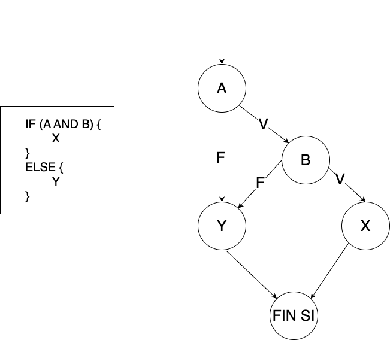
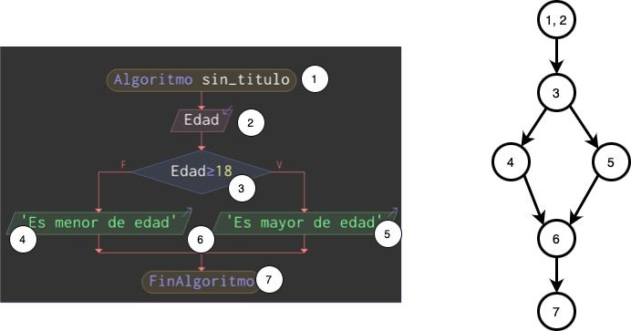

```{r setup, include=FALSE}
knitr::opts_chunk$set(echo = TRUE)
```

También se las conoce como pruebas estructurales o de caja de cristal. Se basan en el minucioso examen de los detalles procedimentales del código de la aplicación. Mediante esta técnica se pueden obtener casos de prueba que: 

- Garanticen que se ejecutan al menos una vez todos los caminos independientes de cada módulo. 
- Ejecuten todas las sentencias al menos una vez. 
- Ejecuten todas las las decisiones lógicas en su parte verdadera yen su parte falsa. 
- Ejecuten todos los bucles en sus límites. 
- Utilicen todas las estructuras de datos internas para asegurar su validez. 

Una de las técnicas utilizadas para desarrollar los casos de prueba de caja blanca es la prueba del camino básico.

## PRUEBA DEL CAMINO BÁSICO
La prueba del camino básico es una técnica de prueba de caja blanca que permite al diseñador de casos de prueba obtener una medida de la complejidad lógica de un diseño procedimental y usar esa medida como guía para la definición de un conjunto básico de caminos de ejecución. Los casos de prueba obtenidos del conjunto básico garantizan que durante la prueba se ejecuta por lo menos una vez cada sentencia del programa.

### GRAFO DE FLUJO
Para la obtención de la medida de la complejidad lógica (o complejidad ciclomática) emplearemos una representación del flujo de control denominada grafo de flujo o grafo del programa.


En el caso de condiciones AND y OR, se generan un mayor número de bifurcaciones de acuerdo con las siguientes estructuras.

Para una condición AND:


**ESTRUCTURA AND**

Para una condición OR:


**ESTRUCTURA OR**

Las características más importantes de los grafos de flujo son:

- Cada círculo del grafo de flujo se llama **nodo**. Representa una o más sentencias procedimentales. Un solo nodo se puede corresponder con a secuencia de símbolos del proceso
y un rombo de decisión. Un ejemplo es el nodo numerado como 1,2
- Las flechas del grafo de flujo se denominan **aristas** o enlaces y representan el flujo de control, como en el diagrama de flujo. Una arista termina en un nodo, aunque el nodo no tenga ninguna sentencia procedimental; es el caso del nodo numerado como 6.
- Las áreas delimitadas por aristas y nodos se llaman **regiones**.
- El nodo que contiene una condición se llama nodo **predicado** y se caracteriza porque de él salen dos o más aristas. 

> el area exterior del grafo es otra región más 

### COMPLEJIDAD CICLOMÁTICA

La complejidad ciclomática es una métrica del software que proporciona una medida cuantitativa de la complejidad lógica de un programa’. En el contexto del método de prueba camino básico, la complejidad ciclomática establece el número de caminos independientes del conjunto básico de caminos de ejecución de un programa, y por lo tanto, el número de casos de prueba que se deben ejecutar para asegurar que cada sentencia se ejecuta al menos una vez. 

La complejidad ciclomática V(G) puede calcularse de tres formas:

1. V(G) = Número de regiones del grafo.
2. V(G) = Aristas - Nodos + 2.
3. V(G) = Nodos predicado + 1

Se establecen los siguientes valores de referencia de la complejidad ciclomática:
 
Complejidad ciclomática | Evaluación de riesgo 
| -- | -- |
Entre 1 y 10 | Programas o métodos sencillos, sin mucho riesgo. 
Entre 11 y 20 | Programas o métodos más complejos, riesgo moderado.
Entre 21 y 50 | Programas o métodos complejos, alto riesgo.
Mayor que 50 | Programas o métodos no testeables, muy alto riesgo.

EI valor de V(G) nos da el número de caminos independientes del conjunto básico de un programa. Un camino independiente es cualquier camino del programa que introduce, por lo menos, un nuevo conjunto de sentencias de proceso o una condición. En términos del diagrama de flujo, un camino independiente está constituido por lo menos por una arista que no haya sido recorrida anteriormente a la definición del camino.

### CASOS DE PRUEBA

Los casos de prueba son, según Wikipedia, ***“un conjunto de condiciones o variables bajo las cuales un analista determinará si una aplicación, un sistema software (software system), o una característica de éstos es parcial o completamente satisfactoria”***. 

En este tema vamos a conocer una vía para obtener de manera sistemática los casos de uso a través de la medición de la Complejidad Ciclomática del modelo visto desde el punto de vista de un grafo. De esta manera podremos  contar con la información acerca del límite superior de pruebas que se deben realizar para asegurar que se ejecuta cada sentencia del caso de uso al menos una vez.

Partiendo de que nunca es posible certificar al 100% si un sistema fallará, para estar seguros de que el sistema no fallará en un número mayoritario de casos, deberíamos probarlo en todas las condiciones y situaciones, con todas las entradas posibles y haciendo uso de toda la funcionalidad. ¿Es esto posible?

Para probar el programa podríamos introducir una edad de 10 años y funcionaría bien, otra edad de 25 años y funcionaría bien también. Pero esto no sería suficiente porque hay muchas más opciones, y podríamos probar a introducir letras a ver si detecta el error, o también podríamos probar con cifras negativas o muy grandes. En realidad, el número de entradas posibles tiende a infinito.

Por tanto, podemos decir que las pruebas exhaustivas no son posibles. Deberíamos seguir una serie de recomendaciones de los expertos sobre cómo se deben hacer las pruebas:

- Las pruebas se diseñarán de forma que tengan la máxima probabilidad de encontrar el mayor número de errores con la mínima cantidad de esfuerzo y tiempo.
- Las pruebas deben centrarse e insistir más en las partes o módulos que más se utilizan o sean mas críticos para el sistema.
- No hay que ver el proceso de prueba como rutinario, sino como un proceso fundamental; por ello, deben destinarse recursos, tiempo, personal experimentado y un proceso creativo.
- No debe asociarse el error a negligencia de un programador; la finalidad de las pruebas debe ser encontrar errores y no desprestigiar a nadie.
- El programador no debe probar sus propios programas. En las grandes empresas existe un equipo de prueba diferente al de desarrollo.
- Los casos de prueba deben incluir tanto entradas correctas como incorrectas para evaluar el comportamiento del sistema en cualquier situación.


## UN EJEMPLO PRÁCTICO

Imaginemos un programa sencillo que nos dice si una persona es mayor o menor de edad. En el programa introducimos una edad y el sistema responde que es mayor de edad si su valor es mayor o igual a 18 años. 

El diagrama de flujo asociado al código puede verse en la siguiente imagen:


Podemos establecer una equivalencia entre el diagrama de flujo (organigrama) obtenido y el grafo de manera muy sencilla:



Una de las cosas que llama la atención es el hecho de que los finales de los bucles y los condicionales se consideran nodos del grafo, algo que hay que tener muy en cuenta a la hora de elaborar nuestro grafo.

Estudiando el grafo generado de nuestro ejemplo se muestran 2 regiones, 8 aristas y 6 nodos.  
En el ejemplo hay 1 nodo predicado, el número 3. Unicamente de estos nodos pueden salir dos aristas.

En nuestro ejemplo, los posibles caminos serán:

- Camino 1: 1-3-4-6-7.
- Camino 2: 1-3-4-5-7.

#### OBTENCIÓN DE LOS CASOS DE PRUEBA 
El último paso de la prueba del camino básico es construir los casos de prueba que fuerzan la ejecución de cada camino. Con el fin de comprobar cada camino, debemos escoger los casos de prueba de forma que las condiciones de los nodos predicado estén adecuadamente establecidas. Una forma de representar el conjunto de casos de prueba es como se muestra en la siguiente tabla:

 Camino | Caso de prueba | Resultado esperado
|:--:|:--:|:--:|
1 | Escoger algún valor de Edad tal que la condición Edad>18 **NO** se cumpla<br>**Edad=10** | Visualizar "Es menor de edad" |
2 | Escoger algún valor de Edad tal que la condición Edad>18 **SI** se cumpla<br>**Edad=20** | Visualizar "Es mayor de edad" |


En ella hemos seleccionado dos valores de muestra que fuerzan un camino u otros.

> La buena elección de los casos de prueba pasa por un buen entendimiento de las condiciones de cada nodo predicado.
