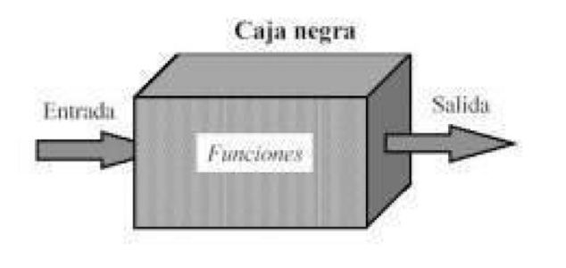
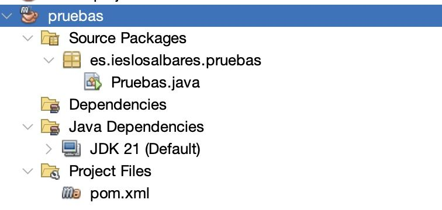
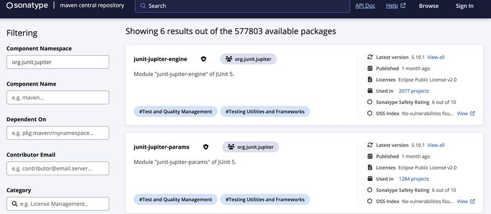
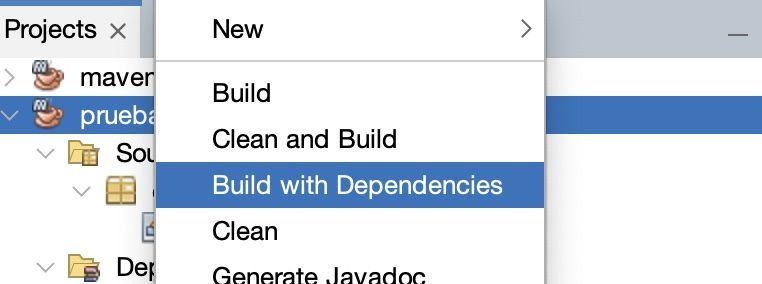
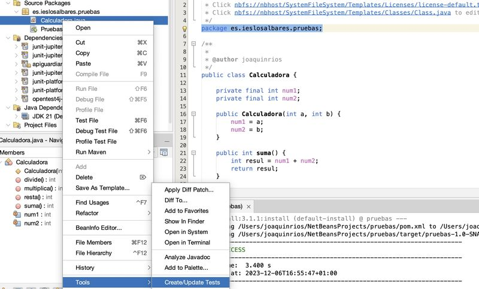
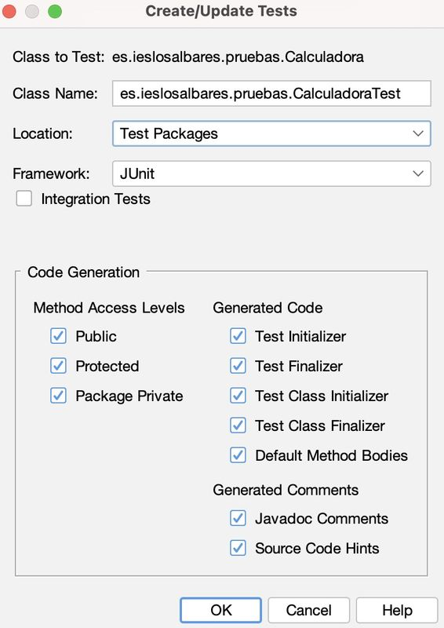
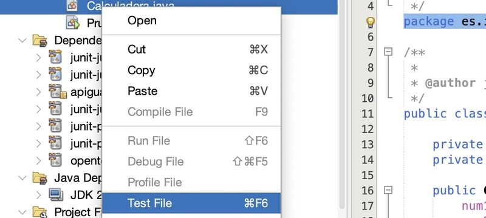
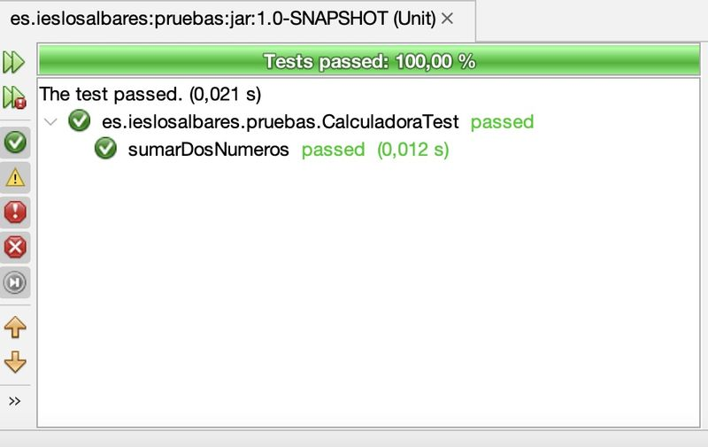

```{r setup, include=FALSE}
knitr::opts_chunk$set(echo = TRUE)
```
## DEFINICIÓN
En contraposición a las pruebas de caja blanca, las Pruebas de Caja Negra, constituyen una técnica de pruebas de software en para comprobar y verificar la funcionalidad de una aplicación sin tener en cuenta la implementación o estructura interna de código, así como los escenarios de ejecución (donde se va a ejecutar).

En estas pruebas, no hace falta conocer la estructura interna del programa ni su funcionamiento. Su busca la obtención de casos de prueba que demuestren que las salidas que devuelve la aplicación son las esperadas en función de las entradas que se proporcionen.


A este tipo de pruebas también se les llama prueba de comportamiento.

Con ellas intentamos encontrar errores de las siguientes categorías: 

- Funcionalidades incorrectas o ausentes. 
- Errores de interfaz. 
- Errores en estructuras de datos o en accesos a bases de datos externas.
- Errores de rendimiento. 
- Errores de inicialización y finalización. 

## TEST UNITARIOS

Son una forma de manera el correcto funcionamiento de una unidad de código. 

Nos ayuda a asegurarnos que cada unidad funcione correctamente y eficientemente por separado. Además de verificar que el código hace lo que tiene que hacer, se puede comprobar que sea correcto el nombre, los nombres y tipos de los parámetros, el tipo de lo que se devuelve.

Para ello, se debe escribir casos de prueba para cada función o método no trivial (que tenga cierta complejidad) en el módulo.

Las pruebas unitarias se realizan sobre una clase para probar su comportamiento de modo aislado independientemente del resto de clases de la aplicación. Aunque esto no siempre es así porque una clase a veces depende de otras clases para poder llevar a cabo su función. 

En nuestro caso vamos a ver dos maneras de realizar test o pruebas:

- **Pruebas de clase**: Se genera una clase de prueba para toda la clase de manera global. Este tipo de pruebas es recomendable en el caso de clases sencillas en los que suele devolver un tipo de dato concreto (integer, char, storing ,…).

- **Pruebas parametrizadas**: En este caso, probamos un método con diferentes conjuntos de parámetros de entrada para comprobar que los procesa de manera correcta y devuelve en cada caso el valor y el tipo correspondiente.

Son dos maneras de abordar las pruebas, que podemos realizar de manera conjunta o independiente según las necesidades de nuestra aplicación.

## HERRAMIENTA JUNIT

JUnit es una herramienta para realizar pruebas unitarias automatizadas. Está integrada en Eclipse Visual Studio Code, por lo que no es necesario descargarse ningún paquete para poder usarla.

Hay problemas con su integración en Netbeans, pero hay soluciones no oficiales por internet.
 
La versión actual es la 5 (JUPITER) y tiene algunos cambios respecto a las versiones anteriores, por lo que es recomendable que todo el mundo use esta versión, si no, habrá problemas a la hora de corregir los ejercicios y/o exámenes.

En el siguiente enlace podéis encontrar más información sobre las novedades de JUNIT 5:

https://www.adictosaltrabajo.com/2016/11/24/primeros-pasos-con-junit-5/

Y por supuesto, visitar la web oficial:

[](https://junit.org/junit5/)

### MÉTODOS DE JUNIT PARA EJECUTAR TEST

Algunos de los métodos que nos sirven para probar nuestras aplicaciones son los siguientes:

- ```assertEquals(String mensaje, valorEsperado, valorReal)```: Comprueba que el valorEsperado sea igual al valorReal. Si no son iguales y se incluye el String, entonces se lanzará el mensaje. ValorEsperado y valorReal pueden ser de diferentes tipos.

- ```assertTrue(String mensaje, boolean expresión)```: Comprueba que la expresión se evalúe a true. Si no es true y se incluye el String, al producirse error se lanzará el mensaje.

- ```assertFalse(String mensaje, boolean expresión)```: Comprueba que la expresión se evalúe a false. Si no es false y se incluye el String, al producirse error se lanzará el mensaje.

- ```assertNull(String mensaje, Object objeto)```: Comprueba que el objeto sea null. Si no es null y se incluye el String, al producirse error se lanzará el mensaje.

- ```assertNotNull(String mensaje, Object objeto)```: Comprueba que el objeto no sea null. Si es null y se incluye el String, al producirse error se lanzará el mensaje.

- ```assertSame(String mensaje, Object objetoEsperado, Object objetoReal)```: Comprueba que objetoEsperado y objetoReal sean el mismo objeto. Si no son el mismo y se incluye el String, al producirse error se lanzará el mensaje.

- ```assertNotSame(String mensaje, Object objetoEsperado, Object objetoReal)```: Comprueba que objetoEsperado y objetoReal no sean el mismo objeto. Si son el mismo y se incluye el String, al producirse error se lanzará el mensaje.

- ```fail(String mensaje)```: Hace que la prueba falle. Si se incluye un String la prueba falla lanzando el mensaje.


## CONCEPTOS PREVIOS: CREACIÓN DE PROYECTOS MAVEN

Para hacer nuestros test unitarios, podemos usar las librerías integradas que vienen por defecto en los IDE o bien importar nuestras propias librerías para realizar los test.

En nuestro caso hemos optado por crear un proyecto Maven e instalar las dependencias necesarias para realizar los test. Esto hace el proyecto independiente del IDE y el sistema operativo que usemos.

Para conocer un poco de maven recomiendo visitar el siguiente enlace:
[¿Qué es Maven?](https://www.arquitecturajava.com/que-es-maven/)

Para conocer mas sobre los proyectos Maven también podemos visitar la página web de Apache, el creador oficial de la herramienta:

https://maven.apache.org/guides/getting-started/

Para crear un proyecto Maven, basta con elegir de las diversas opciones que nos ofrece la pantalla de "Nuevo Proyecto":


Lo configuramos:


y Netbeans nos crea la estructura de carpetas del proyecto:


### INSTALACIÓN DE DEPENDENCIAS

Podemos encontrar las dependecias necesarias en los dos repositorios más famosos:

- [REPOSOTORIO SONATYPE](https://central.sonatype.com/search?namespace=org.junit.jupiter). Es el repositorio recomendado por el desarrollador oficial, con las últimas actualizaciones del plugin.

- [REPOSOTORIO MAVEN](https://mvnrepository.com/). Es el repositorio de Maven creado por un desarrollador particular con una gran cantidad de plugins.

Vamos a elegir la primera opción. Accediendo a la web desde la página oficial, podemos ver las diversas herramientas que JUnit nos ofrece:


Los dos primeros que nos encontramos son los que vamos a usar en la mayoría de los casos.

Haciendo click en cada uno de ellos obtenemos los códigos necesarios para nuestro archivo `pom.xml`:

```xml
<dependency>
    <groupId>org.junit.jupiter</groupId>
    <artifactId>junit-jupiter-engine</artifactId>
    <version>5.10.1</version>
</dependency>
```

Y para los test parametrizados:

```xml
<dependency>
    <groupId>org.junit.jupiter</groupId>
    <artifactId>junit-jupiter-params</artifactId>
    <version>5.10.1</version>
</dependency>
```

Incluimos estas dos librerías en nuestro archivo, que quedaría finalmente :

```xml
<?xml version="1.0" encoding="UTF-8"?>
<project xmlns="http://maven.apache.org/POM/4.0.0" xmlns:xsi="http://www.w3.org/2001/XMLSchema-instance" xsi:schemaLocation="http://maven.apache.org/POM/4.0.0 http://maven.apache.org/xsd/maven-4.0.0.xsd">
    <modelVersion>4.0.0</modelVersion>
    <groupId>es.ieslosalbares</groupId>
    <artifactId>pruebas</artifactId>
    <version>1.0-SNAPSHOT</version>
    <packaging>jar</packaging>
    <properties>
        <project.build.sourceEncoding>UTF-8</project.build.sourceEncoding>
        <maven.compiler.source>21</maven.compiler.source>
        <maven.compiler.target>21</maven.compiler.target>
        <exec.mainClass>es.ieslosalbares.pruebas.Pruebas</exec.mainClass>
    </properties>
    <dependencies>
        <dependency>
            <groupId>org.junit.jupiter</groupId>
            <artifactId>junit-jupiter-engine</artifactId>
            <version>5.10.1</version>
        </dependency>
        <dependency>
            <groupId>org.junit.jupiter</groupId>
            <artifactId>junit-jupiter-params</artifactId>
            <version>5.10.1</version>
        </dependency>
    </dependencies>
</project>
```

Reconstruimos el proyecto para que cargue las dependencias:



Y ya tendríamos el proyecto configurado para realizar test.

## CONCEPTOS PREVIOS DE JAVA: ANOTACIONES

Antes de empezar, debemos conocer un concepto que vamos a utilizar durante el desarrollo de nuestras pruebas: las anotaciones.

Las anotaciones son, según la wikipedia, son ***una forma de añadir metadatos al código fuente Java, y se pueden añadir a los elementos de programa tales como clases, métodos, metadatos, campos, parámetros, variables locales, y paquetes***.

Para una información más detallada, podéis leer este útil enlace:

https://jarroba.com/annotations-anotaciones-en-java/

JUnit dispone de una serie de anotaciones que permiten complementar y ofrecer más información sobre las pruebas, asi como ejecutar código antes y después de las pruebas. Algunas de las más usadas son: 

- `@BeforeEach`: si anotamos un método con esta etiqueta, el código será ejecutado antes de cualquier método de prueba. Podemos usarlo, por ejemplo, en una aplicación de acceso a base de datos para preparar la base de datos. 

- `@AfterEach`: Se pone en métodos cuyo código será ejecutado después de la ejecución de cada uno de los métodos de prueba. Se puede utilizar para limpiar datos. Puede haber varios métodos en la clase de prueba con estas dos anotaciones. 

Existe otras anotaciones que permiten ejecutar código y afectan a la clase en sí. Veamos:
 
- `@BeforeAll`: El método marcado con esta anotación es invocado una vez al principio del lanzamiento de todas las pruebas. Se suele utilizar para inicializar atributos comunes a todas las pruebas o para realizar acciones que tardan un tiempo considerable en ejecutarse. Tanto los atributos modificados como la clase se deben definir como `static`.

- `@Afterall`: Este método será invocado cuando finalicen todas las pruebas. Se puede utilizar para limpiar los atributos de la clase u otras tareas finales. 

Solamente puede haber un método en la clase de prueba con estas dos anotaciones. 


## CREANDO NUESTRO PRIMER TEST

Para testear nuestra aplicación, debemos crear tantos test como métodos tenga la clase a testear, con las siguientes características:

- Los métodos son públicos, no devuelven nada y no reciben ningún argumento.
- El nombre de cada método es recomendable que se llame de la misma manera que el original o bien que vaya precedido de la palabra test (ej: testSuma(), testResta(), testMultiplica(), testDivide()) . 
- Encima de cada uno de los métodos aparece la anotación @Test que indica al compilador que es un método de prueba.
- Para los test parametrizados, incluiremos las anotaciones pertinentes.

Dentro de cada método de test, debemos seguir siempre el mismo procedimiento:
- Creamos una instancia de la clase con los valores que nos interese.
- Invocamos al método que queremos testar. 
- Comprobamos que el valor obtenido coincide con el valor deseado. Para ello hacemos uso de los métodos que nos ofrece la Librería JUnit.

### CREACIÓN DE LA CLASE A TESTEAR

Para comenzar nuestro ejemplo, en primer lugar debemos crear nuestra clase sobre la que vamos a realizar los test.

Para este ejemplo básico, hemos creado esta clase calculadora que incluye cuatro métodos y el constructor, que recibe dos números como entrada.  

La clase calculadora queda así:

```java
package es.ieslosalbares.pruebas;

public class Calculadora {

    private final int num1;
    private final int num2;

    public Calculadora(int a, int b) {
        num1 = a;
        num2 = b;
    }

    public int suma() {
        int resul = num1 + num2;
        return resul;
    }

    public int resta() {
        int resul = num1 - num2;
        return resul;
    }

    public int multiplica() {
        int resul = num1 * num2;
        return resul;
    }

    public int divide() {
        int resul;
        if (num2== 0) {
            resul = 0;
        }
        else resul = num1 / num2; 
        return resul;
    }
}

```

### CREANDO EL TEST
Ahora vamos a crear una clase de prueba para verificar nuestra calculadora. En genera podremos crear la plantilla del test desde el menú de nuestro IDE o bien hacerlo desde cero.

Para el caso de NetBeans, hacemos clic con el botón derecho encima de la clase a testear y elegimos "Tools -> Create/Update Test":



Y elegimos que test, vamos a generar. En la parte izquierda elegimos los tipos de métodos sobre los que queremos generar los test y en la parte de la derecha elegimos los test que afectan a todo el código o toda la clase. Podemos inicialmente desmarcar todo lo de la columna derecha, y puslar en "OK"  



Lo que nos genera un nuevo archivo que se ubicará en la carpeta "test" de nuestro proyecto y que tendrá la siguiente estructura:

```java
package es.ieslosalbares.pruebas;

import org.junit.jupiter.api.Test;
import static org.junit.jupiter.api.Assertions.*;

public class CalculadoraTest {
    
    public CalculadoraTest() {
    }

    @Test
    public void testSuma() {
    }

    @Test
    public void testResta() {
    }

    @Test
    public void testMultiplica() {
    }

    @Test
    public void testDivide() {
    }
    
}
```
 Vemos una estructura similar a una clase Java ordinaria.

Como muestra vamos a comenzar creando el test para el método suma(). Debemos crear un objeto de la clase Calculadora y luego llamar al método suma(). Luego comprobamos que el valor devuelto coincide con el valor esperado.  Se ha incluido la anotación `DisplayName` que muestra el mensaje del método al realizar el test, aunque esta anotación no funciona en NetBeans.


```java
  @Test
	@DisplayName("1 + 1 = 2")
	void sumarDosNumeros() {
		Calculator calculadora = new Calculadora(1, 1);
		assertEquals(2, calculadora.suma(), "1 + 1 debe ser igual a 2");
	}
```

El procedimiento sería similar para el resto.

Para pasar el test, hacemos clic con el botón derecho encima de la clase sobre la que hayamos creado los test y elegimos "Test file":



y en la ventana de resultados podemos ver que el test se pasa satisactoriamente:



Ahora podemos crear una batería de pruebas para probar otro método de esta clase. Para ello vamos usar la anotación @ParameterizedTest para indicar que es un test con parámetros. Al usar este tipo de test, debemos incluir una segunda anotación para indicar de dónde vamos a obtener los valores que vamos a pasar al método. Existen muchas formas de generar valores, y dependerá del método a probar su elección. Aqui hemos optado por una serie de valores CSV (Valores Separados por Coma), que es la mas sencilla de manejar.

El código quedaría así:

```java
@ParameterizedTest(name = "{0} + {1} = {2}")
@CsvSource({
    "0,    1,   -1",
    "2,    1,   1",
    "237,  22, 215",
    "1,  100, -99"
})
void resta(int num1, int num2, int resultadoEsperado) {
    Calculadora calculadora = new Calculadora(num1 , num2);
    assertEquals(resultadoEsperado, calculadora.resta(),
            () -> num1 + " - " + num2 + " debe ser igual a " + resultadoEsperado);
}
```

Podéis ver un interesante tutorial sobre test parametrizados en el siguiente enlace:

https://blog.codefx.org/libraries/junit-5-parameterized-tests/

Si completamos los demás métodos, el test final quedaría así:

```java
package es.ieslosalbares.pruebas;

import org.junit.jupiter.api.Test;
import static org.junit.jupiter.api.Assertions.*;
import org.junit.jupiter.api.DisplayName;
import org.junit.jupiter.params.ParameterizedTest;
import org.junit.jupiter.params.provider.CsvSource;

public class CalculadoraTest {


    @Test
    @DisplayName("1 + 1 = 2")
    void sumarDosNumeros() {
        Calculadora calculadora = new Calculadora(1, 1);
        assertEquals(2, calculadora.suma(), "1 + 1 debe ser igual a 2");
    }

    @ParameterizedTest(name = "{0} - {1} = {2}")
    @CsvSource({
        "0,    1,   -1",
        "2,    1,   1",
        "237,  22, 215",
        "1,  100, -99"
    })
    void resta(int num1, int num2, int resultadoEsperado) {
        Calculadora calculadora = new Calculadora(num1 , num2);
        assertEquals(resultadoEsperado, calculadora.resta(),
                () -> num1 + " - " + num2 + " debe ser igual a " + resultadoEsperado);
    }


    @ParameterizedTest(name = "{0} * {1} = {2}")
    @CsvSource({
        "0,    1,   0",
        "2,    1,   2",
        "10,  22, 220",
        "12,  11, 132"
    })
    public void multiplica(int num1, int num2, int resultadoEsperado) {
        Calculadora calculadora = new Calculadora(num1 , num2);
        assertEquals(resultadoEsperado, calculadora.multiplica(),
                () -> num1 + " * " + num2 + " debe ser igual a " + resultadoEsperado);
    }

    @ParameterizedTest(name = "{0} / {1} = {2}")
    @CsvSource({
        "0,   1,  0",
        "2,   1,  2",
        "24,  6,  4",
        "111, 10, 11"
    })
    public void divide(int num1, int num2, int resultadoEsperado) {
        Calculadora calculadora = new Calculadora(num1 , num2);
        assertEquals(resultadoEsperado, calculadora.divide(),
                () -> num1 + " / " + num2 + " debe ser igual a " + resultadoEsperado);
    }

}
```
