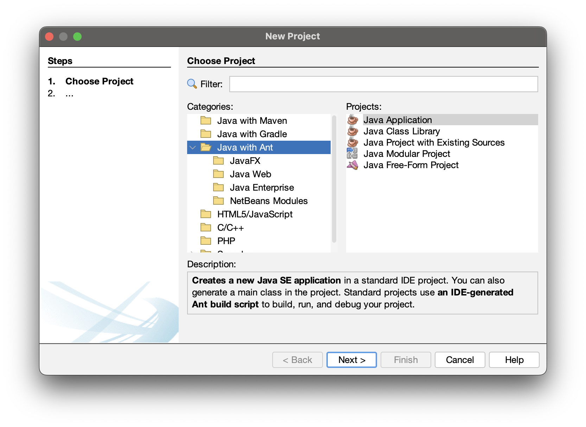
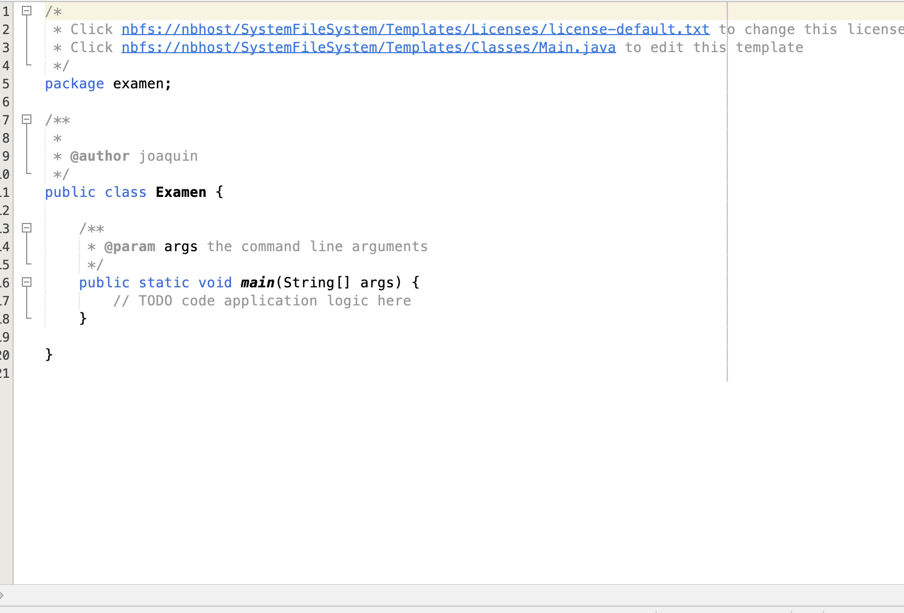
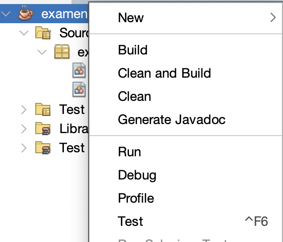
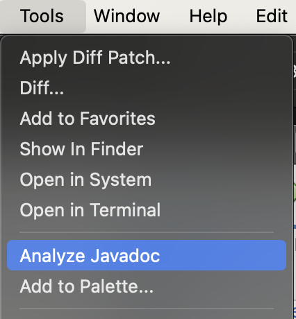
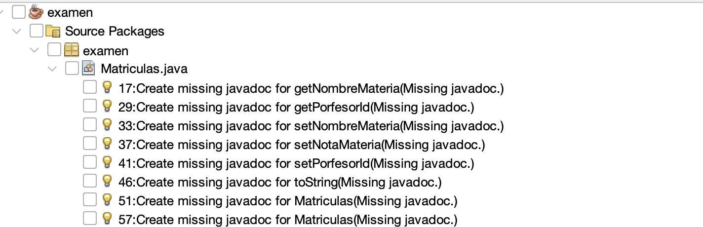

## 1. REFACTORIZANDO

Para comenzar, crearemos un preoyecto basado en Ant:

El proyecto se organiza dentro de un package y con un archivo que contiene el Main:

Ahora procedemos a borrar y pegar el archivo java que queremos refactorizar. Vamos analizando uno por uno los errores que nos salen y solucinándolos.

Aplicamos los cuatro procedimientos de refactorización:
1. **Encapsular atributos**. Creamos los getter y setter que falten.
2. **Organizar clases**. Cada clase dentro de su package.
3. **Renombrar** atributos y métodos por valores significativos.
4. **Crear métodos** para trozos de código grandes.

## 2. GENERANDO LA DOCUMENTACIÓN.

Para hacer la documentación es hacer click en la linea del metodo que vamos a documentar.
Aparece la bombilla a la izquierda y podemos elegir `generate Javadoc for ...` para cada método y cada atributo.

Cuando ya hayamos comentado los métodos y los atributos, podemos generar el Javadoc haciendo  click con el botón derecho encima de nuestro proyecto y seleccionar `Generate Javadoc`

Esto nos genera toda la documentación de manera automática.

Por último, podemos comprobar si el Javadoc está bien generado haciendo click en `Tools->Analyze Javadoc`, lo que nos muestra lo que falta por solucionar:

Y podemos arreglarlo haciendo click en el proyecto para que solucione todo de una:

